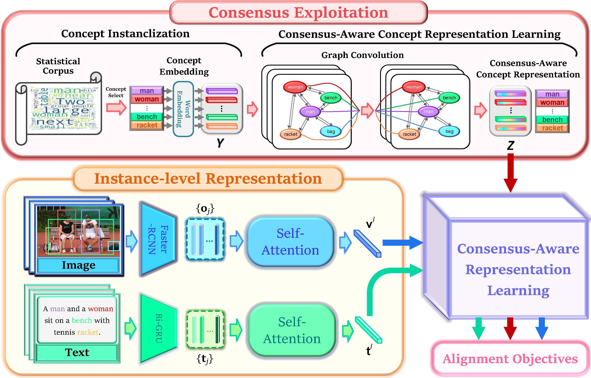

# Introdcurion
This is **Consensus-Aware Visual-Semantic Embedding (CVSE)**, the official source code for the paper [Consensus-Aware Visual-Semantic Embedding for Image-Text Matching (ECCV 2020)](http://arxiv.org/abs/2007.08883). It is built on top of the [VSE++](https://github.com/fartashf/vsepp) in PyTorch.

**Abstract:**

Image-text matching plays a central role in bridging vision and language. Most existing approaches only rely on the image-text instance pair to learn their representations, thereby exploiting their matching relationships and making the corresponding alignments. Such approaches just exploit the superficial associations contained with the instance pairwise data, with no consideration of any external commonsense knowledge, which may hinder their capabilities to reason the higher-level relationships between image and text. In this paper, we propose a Consensus-Aware Visual-Semantic Embedding (CVSE) model to incorporate the consensus information, namely the commonsense knowledge shared between both modalities, into image-text matching. Specifically, the consensus information is exploited by computing statistical co-occurrence correlations between the semantic concepts from the image captioning corpus and deploying the constructed concept correlation graph to yield the consensus-aware concept (CAC) representations. Afterwards, CVSE learns the associations and alignments between image and text based on the exploited consensus as well as the instance-level representations for both modalities. Extensive experiments conducted on two public datasets verify that the exploited consensus makes significant contributions to constructing more meaningful visual-semantic embeddings, with the superior performances over the state-of-the-art approaches on the bidirectional image and text retrieval task.

**The framework of CVSE:**



**The results on MSCOCO and Flicke30K dataset:**
<table>
  <tr>
    <td></td>
    <td colspan="3">Image-to-Text</td>
    <td colspan="3">Text-to-Image</td>
    <td></td>
  </tr>
  <tr>
    <td>Dataset</td>
    <td>R@1</td>
    <td>R@5</td>
    <td>R@10</td>
    <td>R@1</td>
    <td>R@5</td>
    <td>R@10</td>
    <td>mR</td>
  </tr>
  <tr>
    <td>MSCOCO</td>
    <td>78.6</td>
    <td>95.0</td>
    <td>97.5</td>
    <td>66.3</td>
    <td>91.8</td>
    <td>96.3</td>
     <td>87.6</td>
  </tr>
  <tr>  
    <td>Flickr30k</td>
    <td>73.6</td>
    <td>90.4</td>
    <td>94.4</td>
    <td>56.1</td>
    <td>83.2</td>
    <td>90.0</td>
    <td>81.3</td>
  </tr>
</table>

## Requirements and Installation
We recommended the following dependencies.
*  Python 3.6
*  PyTorch 1.1.0
*  NumPy (>1.12.1)
*  TensorBoard
*  torchtext
*  pycocotools

## Download data
Download the dataset files. We use the image feature created by SCAN, downloaded [here](https://github.com/kuanghuei/SCAN). All the data needed for reproducing the experiments in the paper, including image features and vocabularies, can be downloaded from:
```bash
wget https://scanproject.blob.core.windows.net/scan-data/data.zip
wget https://scanproject.blob.core.windows.net/scan-data/vocab.zip
```
In this implementation, we refer to the path of extracted files for `data.zip` as `$data_path` and files for `vocab.zip` to `./vocab_path` directory.

## Training

* Train MSCOCO models:
Run `train_coco.py`:
```bash
python train_coco.py --data_path "$DATA_PATH"
```

* Train Flickr30K models:
Run `train_f30k.py`:
```bash
python train_f30k.py --data_path "$DATA_PATH"
```


## Evaluate trained models
+ Test on MSCOCO dataset:
  + Test on MSCOCO 1K test set
  ```bash
  python evaluate.py --data_path "$DATA_PATH" --data_name 'coco_precomp' --model_path './runs/coco/CVSE_COCO/model_best.pth.tar' --data_name_vocab coco_precomp --split test 
  ```
  + Test on MSCOCO 5K test set
  ```bash
  python evaluate.py --data_path "$DATA_PATH" --data_name 'coco_precomp' --model_path './runs/coco/CVSE_COCO/model_best.pth.tar' --data_name_vocab coco_precomp --split testall 
  ```

+ Test on Flickr30K dataset:
```bash
python evaluate.py --data_path "$DATA_PATH" --data_name 'f30k_precomp' --model_path './runs/f30k/CVSE_f30k/model_best.pth.tar' --data_name_vocab f30k_precomp --split test 
```

+ Test on dataset transfer (MSCOCO-to-Flickr30K):
```bash
python evaluate.py --data_path "$DATA_PATH" --data_name 'f30k_precomp' --model_path './runs/coco/CVSE_COCO/model_best.pth.tar' --data_name_vocab coco_precomp --transfer_test --concept_path 'data/coco_to_f30k_annotations/Concept_annotations/'
```

## Reference

If CVSE is useful for your research, please cite our paper:

```
@article{Wang2020CVSE,
  title={Consensus-Aware Visual-Semantic Embedding for Image-Text Matching},
  author={Wang, Haoran and Zhang, Ying and Ji, Zhong and Pang, Yanwei and Ma, Lin},
  booktitle={ECCV},
  year={2020}
}
```

## Acknowledgement
Part of our code is borrowed from [SCAN](https://github.com/kuanghuei/SCAN). We thank to the authors for releasing codes.

## License

[MIT License](https://opensource.org/licenses/MIT)


